# Práctica 0: Primera aproximación a Java

## Fecha de entrega: semana del 19 de septiembre de 2022

En esta primera práctica vamos a tomar contacto con el entorno que usaremos para realizar las prácticas de la asignatura *Tecnología de la Programación I*.

Se trata de una práctica guiada donde el enunciado va describiendo uno a uno los pasos a seguir. La mayoría de los pasos que se describen serán necesarios también para el resto de prácticas, pues se enseña tanto la construcción de la estructura de directorios que utilizaremos como la creación de los proyectos de Eclipse y el mecanismo de entrega.

En este curso utilizaremos [*Java17*](https://www.oracle.com/java/technologies/downloads/#java17) y [*Eclipse 22.03*](https://www.eclipse.org/downloads/packages/release/2022-03/r) ya que éstas son las versiones de las herramientas que están instaladas en los laboratorios de la Facultad.

> Eclipse 2022-03 ya viene con un Java 17 integrada, pero para realizar al menos esta práctica en tu equipo tienes que instalar Java de manera independiente.

Con un poco de cuidado se pueden utilizar otras versiones posteriores manteniendo la compatibilidad, **pero debes de asegurarte de que funciona en estas versiones de cara a la corrección**.

## Estructura de directorios

Antes de comenzar, describiremos brevemente la estructura de directorios que vamos a utilizar durante todas las prácticas. Utilizar una estructura de directorios clara es importante cuando un proyecto utiliza varios ficheros de distintos tipos. Durante la elaboración de la práctica, manejaremos los siguientes directorios:

- `src`: directorio con el código fuente de la práctica (ficheros con extensión `.java`). Es el único directorio que contiene ficheros elaborados durante las prácticas. Los otros directorios o bien los  genera Eclipse automáticamente, o bien su contenido puede ser proporcionado por el profesor.
- `bin`: directorio donde aparecerán los ficheros resultado de la compilación del código fuente anterior. Lo crea el IDE (el entorno de desarrollo, esto es, Eclipse) automáticamente.

En prácticas siguientes es posible que se utilicen directorios adicionales. En concreto, si la práctica hace uso de bibliotecas externas proporcionadas por el profesor, podría aparecer otro directorio donde se añaden esas librerías. Este directorio *no* se deberá incluir en la entrega.

## Primera parte: "Hola mundo" en consola

La primera parte de la práctica consiste en la creación de un proyecto simple en Java que escribe un simple `Hola mundo`.

### Paso 1:

Abrimos el terminal `cmd.exe` (Windows > Ejecutar > `cmd.exe`). Una vez que se abre el terminal, debemos ubicarnos en el directorio `hlocal`ejecutando `cd c:\hlocal`.

Se crea un primer fichero de texto llamado "HolaMundo.java", que puede editarse con el NotePad++ / VS Code / block de notas[^1]. Java es sensible a mayúsculas/minúsculas, por lo que es importante mantener las mayúsculas donde se menciona aquí. Como puede observarse, el fichero tiene extensión `java`.

La siguiente imagen muestra cómo invocar el bloc de notas desde la línea de comandos de Windows.

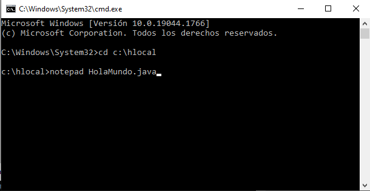

### Paso 2:

En el fichero creado en el paso anterior definimos una clase llamada "HolaMundo". Ojo, el nombre de la clase debe ser igual al del    fichero. El código a escribir es el siguiente:

```Java
class HolaMundo {
    public static void main(String[] args){
        System.out.println("Hola Mundo!");
    }   
}
```

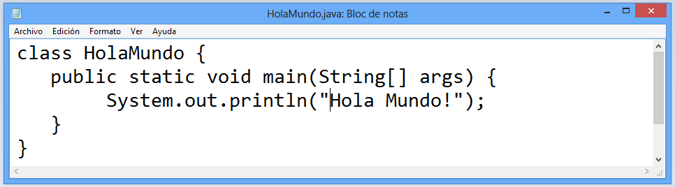

### Paso 3:

Compilar `HolaMundo.java` desde la línea de comandos de Windows con  el comando:

```
javac HolaMundo.java
```

Si no hay errores de compilación se creará el fichero `HolaMundo.class`.


Para poder invocar al compilador (`javac.exe`), éste debe estar accesible a través del PATH. Tendremos que agregar al PATH la dirección de la carpeta `bin` del JDK. En los laboratorios se encuentra en el directorio `C:\JDK\jdk17-x86_64\bin`. Para agregarlo podemos utilizar el siguiente comando:

```
set PATH=C:\JDK\jdk17-x86_64\bin;.;%PATH%
```

Posteriormente, para asegurarnos de que estamos usando la versión correcta, podemos ejecutar el siguiente comando:

```
java -version
```

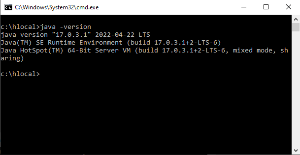

### Paso 4:

Para ejecutar la aplicación se debe ejecutar la máquina virtual de Java y pedirle que utilice como punto de entrada de la aplicación la  clase `HolaMundo.class`. Para eso, se ejecuta el comando `java HolaMundo`[^2]. Igual que para compilar el código, para poder ejecutar la aplicación debe estar disponible `java` en el PATH. En los laboratorios se puede encontrar en el mismo directorio que el compilador.

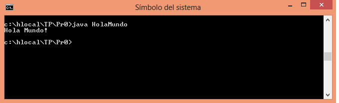

## Segunda parte: "Hola mundo" en Eclipse

Antes de empezar a trabajar en la plataforma de Eclipse, debemos aprender el significado de *workspace*.

1. Un espacio de trabajo (*workspace*) es una carpeta donde estarán las carpetas correspondientes a los proyectos Java creados con Eclipse.
2. Una instancia en ejecución de Eclipse sólo puede trabajar con un workspace a la vez.
3. Cambiar el workspace requiere reiniciar Eclipse.

En lo que sigue asumiremos que el workspace lo ubicaremos en el directorio `c:\hlocal\TP`[^3].

> Recuerda borrar el directorio del proyecto (o del workspace) antes de terminar la sesión de laboratorio para evitar que alguien pueda utilizar tu código y pueda ser detectado como una copia de la práctica. 

Un *proyecto* es una carpeta que se crea en el workspace. Cada práctica será un proyecto nuevo. Dentro de un proyecto nos encontraremos las siguientes carpetas:

- `src`: Carpeta donde estará el código fuente (`source code`), es decir, los ficheros `.java`. **Ésta es la que nos tenemos que guardar (GDrive, OneDrive, directorio de red, etc.) cuando se acabe cada sesión de laboratorio**.

- `bin` : Carpeta donde estarán los ficheros compilados, que tienen extensión `.class` y contienen los *bytecode*s interpretables por la máquina virtual de Java. **No es necesario guardar esta carpeta pues se  puede generar a partir del código fuente**. Por defecto, esta carpeta está oculta en Eclipse, aunque puedes verificar su contenido a través del explorador de archivos de tu Sistema Operativo.

> Aunque es un poco más avanzado, si te animas, puedes utilizar git y GitHub para alojar tu práctica y de paso facilitar la coordinación con tu compañero/a de prácticas. **Recuerda crear el proyecto de manera privada** para que no te puedan copiar la práctica. Eclipse tiene soporte integrado para Git, aunque también está instalado en los laboratorios un cliente git más amigable llamado [SourceTree](https://www.sourcetreeapp.com/).

A continuación trasladamos el ejemplo anterior a la plataforma de trabajo Eclipse.

### Paso 1:

Ejecutar `Eclipse.exe`.

### Paso 2:

Crear un nuevo workspace. Si ya está abierto Eclipse, cambiar al workspace deseado desde el menú *File* -> *Switch Workspace* de Eclipse.

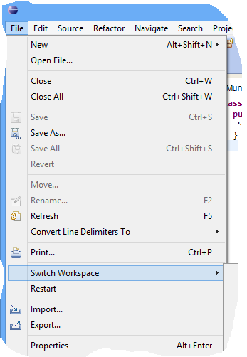

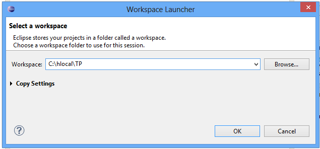

### Paso 3:

Crear un proyecto: *File* -> *New* -> *Java Project*. Recuerda que cada práctica será un proyecto nuevo. Por otro lado, en la última sección *Module*, **desmarca la opción *Create module-info.java file*** en caso de que aparezca marcada. 

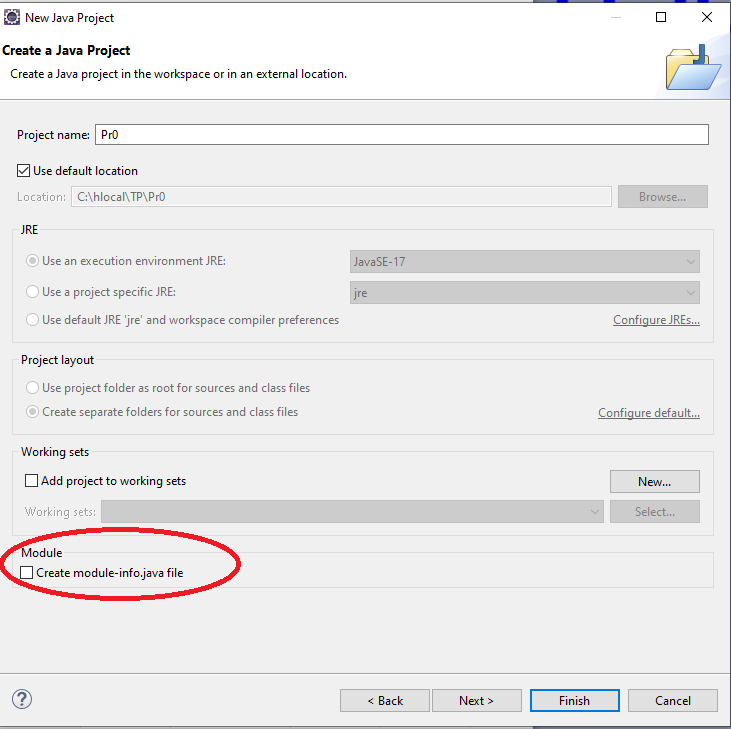

### Paso 4:

La creación de un proyecto requiere indicar las carpetas **src** y  **bin**. Puedes mantener los valores por defecto que deja Eclipse para los mismos.

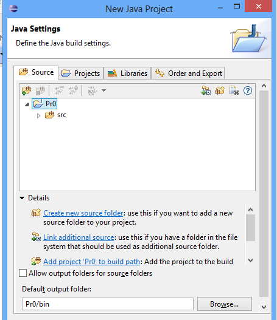


### Paso 5:

Para evitar problemas de compatibilidad entre plataformas debemos configurar el proyecto para utilizar la codificación de caracteres *UTF-8*. Selecciona el proyecto y pulsa el botón derecho  seleccionando la opción *Properties*. Elige el menú *Resource* y  modifica *Text File Encoding* seleccionando *Other* e indicando *UTF-8*.

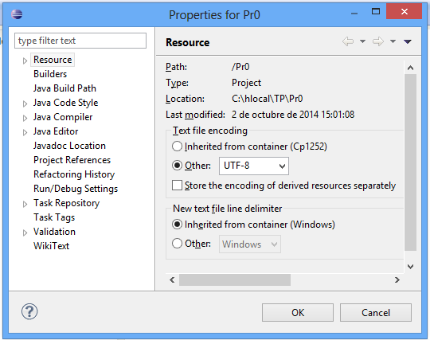

**Este paso se deberá realizar al crear cada proyecto**, aunque es  posible configurar Eclipse para que cualquier proyecto del
*workspace* utilice codificación *UTF-8*. Para ello selecciona  *Window* -> *Preferences* y elige el menú *General*
-> *Workspace*. Ahora modifica *Text File Encoding* seleccionando *Other* e indicando *UTF-8*.

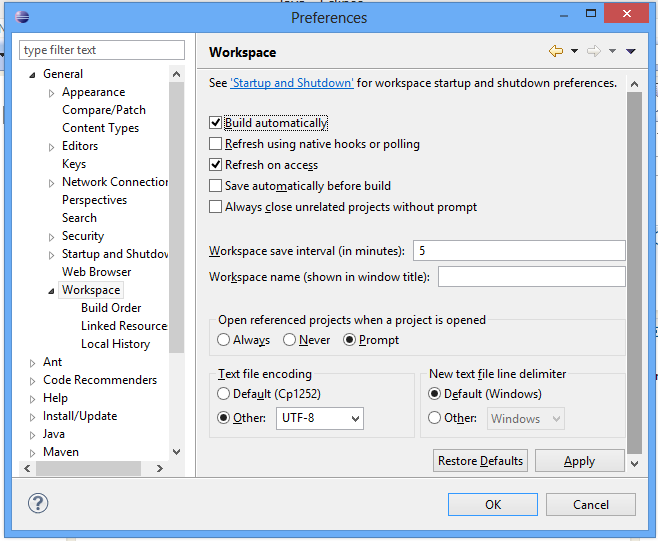

### Paso 6:

Una vez tenemos Eclipse configurado, vamos a realizar nuestro primer programa en Eclipse. Para ello, primero tendrás que crear una clase llamada "HolaMundo": desde el menú *File* -> *new Class*.

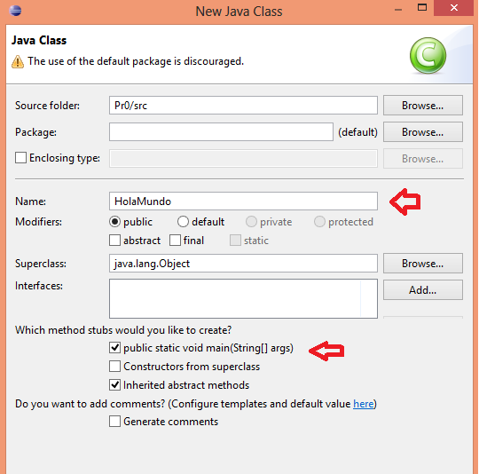

### Paso 7:

Se puede ver que Eclipse habrá almacenado el fichero `HolaMundo.java` en la ruta esperada, `C:\hlocal\TP\Pr0\src\HolaMundo.java`.

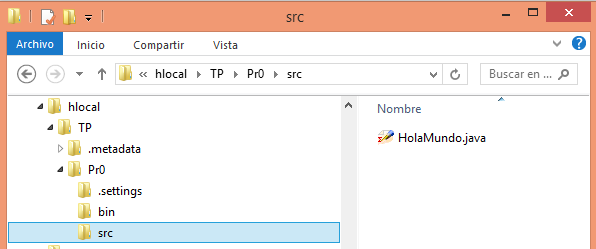

### Paso 8:

Escribir el código de la clase "HolaMundo".

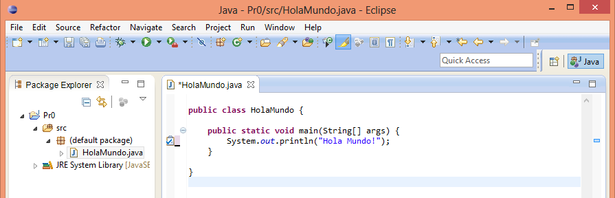

### Paso 9:

Para ejecutar la aplicación, Eclipse ofrece distintas formas. Una de ellas es:

-   Seleccionar la clase `HolaMundo.java` en la pestaña *Package Explorer* (situado a la izquierda).
-   Pulsar el botón derecho.
-   Seleccionar *Run As* -> *Java Application*.

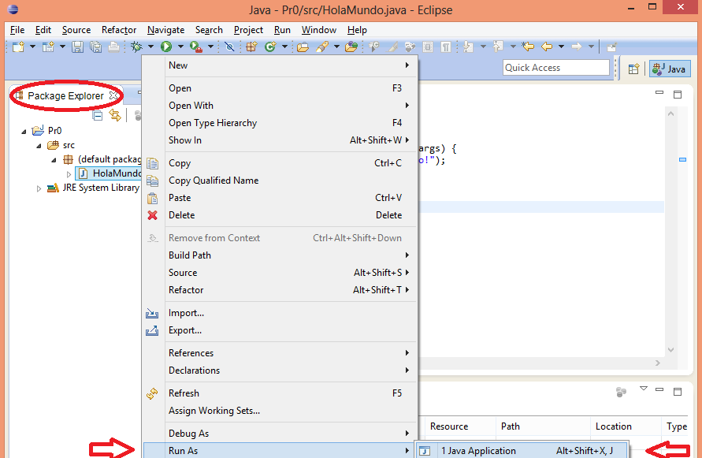

Otra alternativa es pulsar el icono verde de "Run" después de seleccionar la clase `HolaMundo.java` en la pestaña *Package Explorer*.

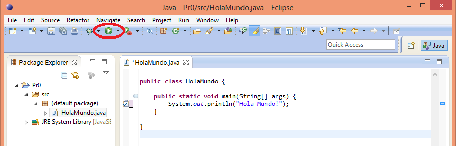

### Paso 11:

Eclipse ha compilado nuestro fichero de código fuente y el resultado de esa compilación ha sido un fichero con el mismo nombre y extensión `.class`. Podemos ver que en la carpeta `C:\hlocal\TP\Pr0\bin\` tenemos el fichero `HolaMundo.class`.

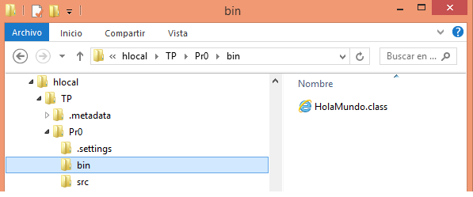

## Tercera parte: método nuevo de la clase

En Eclipse las clases se pueden organizar en paquetes (*packages*). Para crear un paquete es necesario seleccionar la carpeta *src* en en la pestaña *Package Explorer* y posteriormente seleccionar *File* -> *New* -> *package*.

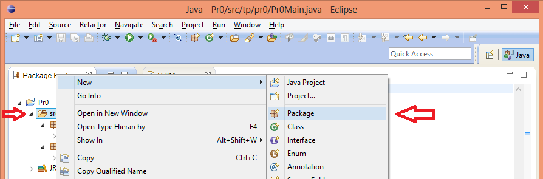

Crear el paquete `tp.pr0`.

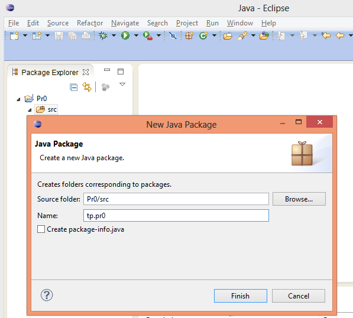

Crear la clase `Pr0Main` dentro del paquete `tp.pr0`.

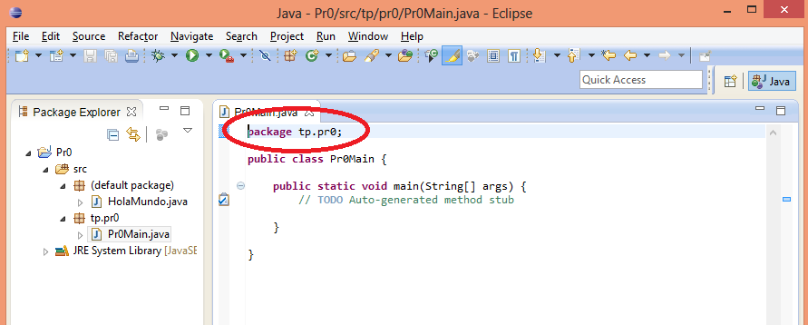

En dicha clase, además de tener un método `main` para que sea ejecutable, vamos a añadir un método estático, similar a las funciones procedurales, al que poder llamar desde el método principal. Al ser un método estático no es necesario que lo llame un objeto instanciado, sino que se califica con el nombre de la clase.

``` Java
package tp.pr0;

class Pr0Main {

   public static void escribeSaludo(String nombre) {
      System.out.println("Hola, " + nombre);
   }

   public static void main(String args[]) {
      Pr0Main.escribeSaludo("Walterio Malatesta");
   }
}
```

**Notas:**

- Como convención, los nombres de los datos y métodos en una clase se escriben en minúsculas. Sólo las clases e interfaces van con mayúsculas.
- Todas las instrucciones se terminan en \";\".
- Obsérvense las carpetas que Eclipse crea en el directorio `src` para alojar el código fuente de las clases pertenecientes al nuevo paquete y la ubicación de `Pr0Main.java` y `Pr0Main.class`.

## Cuarta parte: clase matemática
En esta parte hacemos una clase nueva que contiene algunas funciones matemáticas simples y que utilizaremos desde el método `main` para escribir una lista de números combinatorios.

Se debe crear la clase `FuncsMatematicas` en el paquete `tp.pr0`. Contendrá dos métodos estáticos adicionales:

- `public static int factorial (int n)`

- `public static int combinatorio (int n, int k)`

Ambos métodos están descritos en el siguiente documento generado con el comando `javadoc`:

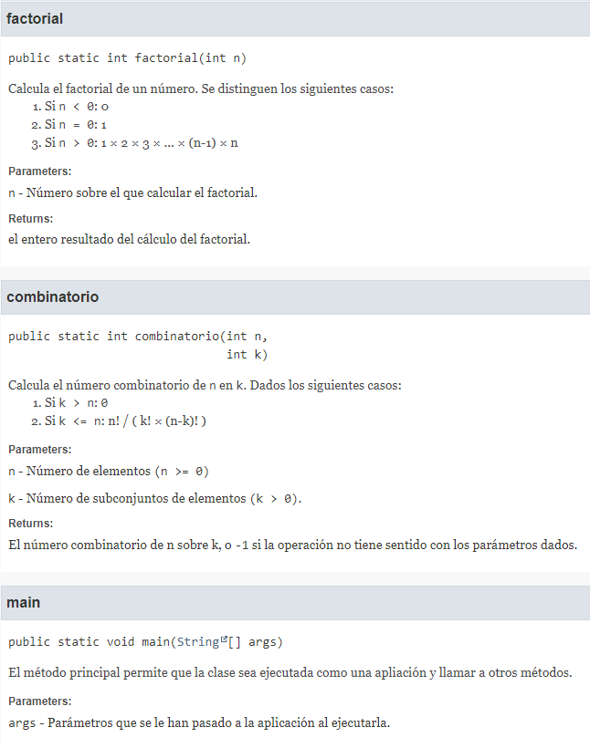

Teniendo en cuenta que, como se indica en la documentación de la clase:

* ${n \choose k} = \frac{n!}{k!(n-k)!}$
*   El factorial de 0 es 1, y si nos preguntan por el factorial de un número negativo, devolveremos un 0.
*   En el caso de los números combinatorios el cálculo sólo tiene sentido si se cumple que 0 <= k <= n. Es decir:
    * Si k < 0 o n < 0: devolveremos -1
    * Si k > n: devolveremos 0
    * Si todas las condiciones se cumplen, aplicaremos la fórmula anterior

**Notas**:
Es mejor utilizar como variables locales para guardar los resultados de los factoriales un `long`. Una vez realizado, podemos probarlo con el código siguiente en el método `main`:

``` Java
for (int i = 0; i < 6; ++i) {
  for (int j = 0; j <= i; ++j) {
    System.out.print(FuncsMatematicas.combinatorio(i,j) + " ");
  }
  System.out.println();
}
```

Cuya salida debería ser:
``` Java
1 
1 1 
1 2 1 
1 3 3 1 
1 4 6 4 1 
1 5 10 10 5 1 
```

## Quinta parte: entrega de la práctica
Una vez que la práctica está implementada llega el momento de la entrega. Para entregar la práctica se utilizará el mecanismo de entregas del campus virtual. La fecha límite concreta de tu grupo estará disponible en el mismo.

Para entregar la práctica se debe comprimir la solución en un fichero `.zip` cuyo nombre será `Practica0.zip`. El fichero deberá contener únicamente:

- Un archivo `alumnos.txt` con el nombre de los miembros del grupo.

- El directorio `src` con el código fuente de la práctica.

- Opcionalmente, los directorios de proyecto que genera Eclipse: ficheros `.classpath`, `.project` y directorio `.settings` (`.settings` y `.project`, por defecto, no son visibles en la vista de Eclipse).

Puedes utilizar la opción *File* -> *Export* -> *Archive File* para generar un archivo .zip y seleccionar los directorios y ficheros que quieres incluir en el fichero. `.zip`.

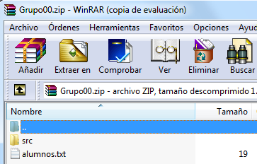

[^1]: Todas las prácticas de la asignatura podrán realizarse en cualquier plataforma en la que pueda ejecutarse Eclipse, en esta descripción asumiremos que se está utilizando Windows.

[^2]: Observar que *no* se debe poner la extensión, `.class`.

[^3]: Es muy desaconsejable el uso de las memorias USB como workspace ya que la vida útil de las mismas se reduce drásticamente por la cantidad de operaciones que se hacen sobre ellas. Por otro lado, el uso de la unidad virtual de cada uno como workspace es desaconsejable por la velocidad del mismo y la cantidad de ficheros intermedios, no necesarios, que pueden llegar a generarse.

## Apéndice 1: Visualizador de Markdown

Para acabar de configurar Eclipse, vamos a instalar (o verificar que ya está instalado) un visualizador de Markdown que nos será útil en futuras etapas. Markdown es un lenguaje de marcado ligero enfocado en conseguir una óptima legibilidad y facilidad de publicación tanto en su forma de entrada como de salida. Para instalarlo en Eclipse:

- Selecciona *Help* -> *Eclipse Marketplace* en el menú superior:

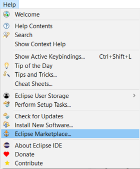

- En la caja de texto del buscador, escribe "*wikitext*":

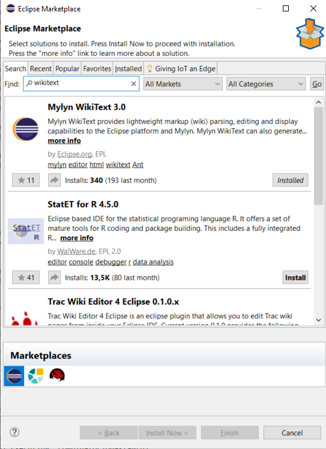

verifica que ya tienes instalado el plugin *Mylyn WikiText 3.0". Si te has bajado el eclipse recomendado / enlazado al comienzo de estas instrucciones *ya viene incluido*.

## Apéndice 2: Configuración de un JRE el workspace de Eclipse

Como hemos comentado al comienzo de la práctica, Eclipse viene integrado con una instalación de Java 17. Si quieres utilizar una instalación específica de Java, puedes hacerlo, pero tienes que modificar las preferencias de tu *workspace*.

Para modificar las preferencias selecciona *Window* -> *Preferences*. Puedes teclear "JRE" en el buscador o navegar hasta llegar a la opción *Java* -> *Installed JREs*. Una vez allí pulsa en el botón *Add...*

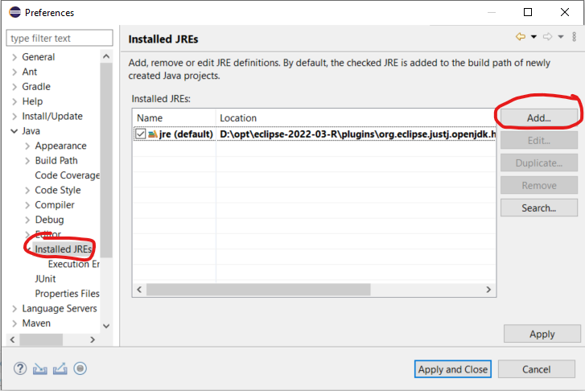

En la siguiente pantalla asegúrate que está seleccionada la opción "Standard VM" y pulsa en el botón *Next...*

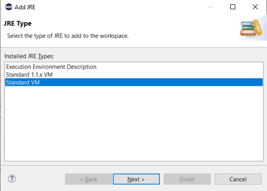

En la nueva ventana pulsa en el botón *Directory...* y selecciona el directorio donde has instalado / descomprimido la instalación de Java que deseas configurar.

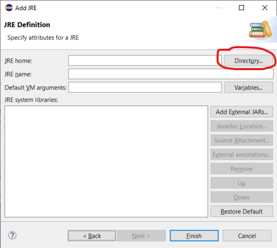

Si has seleccionado correctamente el directorio, podrás ver que Eclipse rellena automáticamente algunos de los apartados de la ventana. Si es así, pulsa simplemente *Finish*.

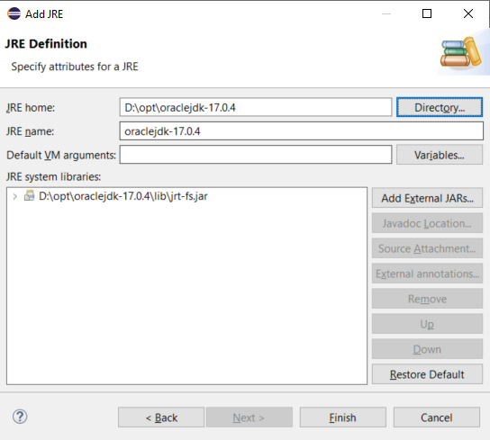

Una vez que has añadido tu nueva instalación de Java, es recomendable que la selecciones como opción por defecto para no tener que configurar cada nuevo proyecto que crees dentro del *workspace*.

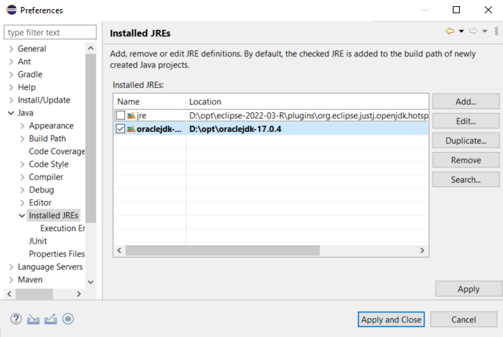
